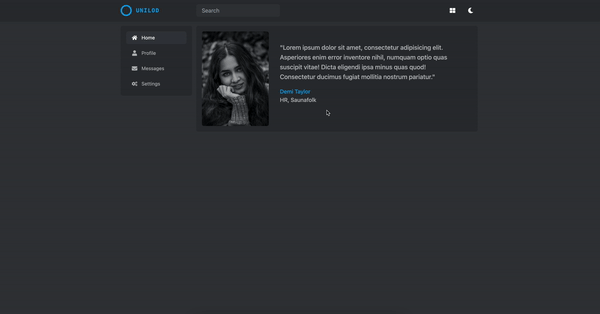

# simple-hackathon-vue

<p align="center">

</p>

Simple [Vue-js](https://vuejs.org/) project template for hackathon based on [tailwindcss](https://tailwindcss.com/)

## Features
* [x] Three responsive layouts
* [x] Theme switcher
* [x] Layout switcher
* [x] Template based on tailwindcss
* [x] Reusable layouts components

## Live demo
[https://awakentrue.github.io/simple-hackathon-vue/](https://awakentrue.github.io/simple-hackathon-vue/)

## Usage
### 1. Fork or clone this repository
```
 git clone https://github.com/awakentrue/simple-hackathon-vue.git 
```
### 2. Install [Node.js](https://nodejs.org/en/)

### 3. Install dependencies
```
npm install
```
### 4. Serve with hot reload
```
npm run serve
```
### 5. Build for production
```
npm run build
```
